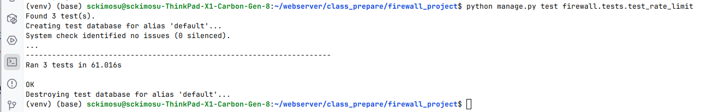
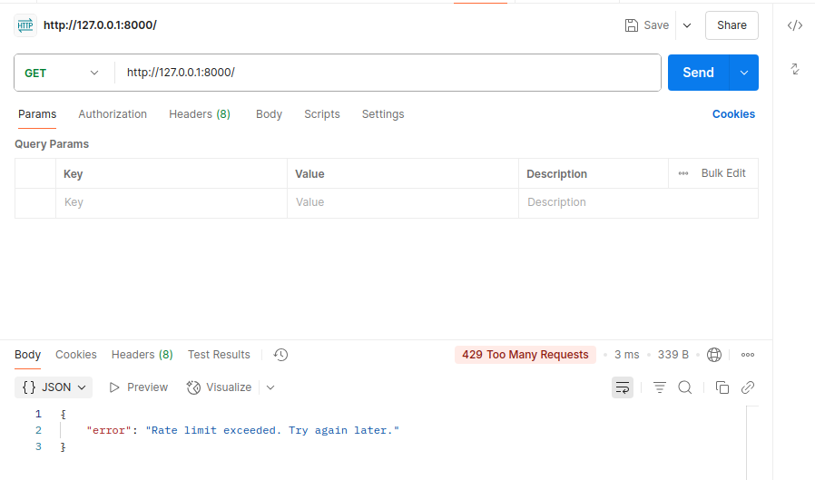
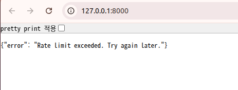

# [웹서버14주차]Rate Limiting 미들웨어 구현

## ✅ 1. 방화벽의 기본 역할

- 일반적인 **네트워크 방화벽(Network Firewall)** 은 **네트워크 레벨**에서 트래픽을 제어하여, **허가되지 않은 접근을 차단**하고 **허용된 트래픽만 통과**시키는 보안 시스템

| 기능 | 설명 |
| --- | --- |
| **패킷 필터링** | IP, 포트, 프로토콜 기반으로 허용/차단 (예: TCP 80만 허용) |
| **상태 기반 검사** | 연결 상태 추적 (stateful inspection) 후 세션 일관성 유지 |
| **포트/프로토콜 제한** | HTTP(80), HTTPS(443), SSH(22) 등 필요한 서비스만 열기 |
| **IP 차단/허용** | 특정 IP 또는 IP 범위(block)만 허용하거나 차단 |
| **로그 기록** | 접속 시도 및 차단 내역을 기록하여 보안 분석 가능 |
| **침입 탐지/방지** | 비정상적 패턴 탐지 (IDS/IPS 연계 시) |

---

## ✅ 2. 방화벽 위치

```
[클라이언트]
    ↓
[라우터/방화벽 (IP, Port 기준 필터링)]
    ↓
[웹서버 (Nginx)]
    ↓
[애플리케이션 서버 (Gunicorn, Django)]
    ↓
[DB서버]
```

---

## ✅ 3. 방화벽 vs 애플리케이션 레벨 제어 (장고 미들웨어)

| 구분 | 네트워크 방화벽 | 애플리케이션(Middleware) |
| --- | --- | --- |
| 위치 | 서버 밖 | Django 내부 |
| 기준 | IP, Port, Protocol | 사용자 인증, DB 기반 IP 등 |
| 속도 | 빠름 | 느림 (Django까지 도달) |
| 유연성 | 낮음 | 높음 (DB기반 동적 처리 가능) |

---

## ✅ 목표 : 장고에서 **IP 기반 Rate Limiting을 구현하는 미들웨어**

- 클라이언트 IP당 **N초당 M번 이하 요청만 허용**
- 초과 시 `429 Too Many Requests` 응답
- **장고 미들웨어**로 구현

---

## 🧩 구현 로직

- 클라이언트 IP별 요청 타임스탬프 저장
- `N초` 간격 내 요청 횟수 카운팅
- Redis, DB 없이 **in-memory (딕셔너리)** 캐시 사용
    
    ---
    

## 💡 작동 원리

- 각 IP별 요청 시각을 `deque`에 저장
- 매 요청마다 오래된 타임스탬프 제거 (`time_window` 기준)
- 새 요청 추가 전, 현재 남은 요청 개수로 제한 검사

---

## ✅ Rate Limiting 구현

- 특정 시간 동안 **클라이언트가 보낼 수 있는 요청 수를 제한**하는 기술
    - 보안(DoS/DDoS 방어), 자원 보호, API 사용 통제 등에 사용

| 방식 | 위치 | 도구 | 설명 |
| --- | --- | --- | --- |
| **UFW** | 서버 방화벽 | `ufw` (Uncomplicated Firewall) | 기본적인 `connection limit` 적용 가능 (IP당 접속 횟수 제한) |
| **Nginx** | Reverse Proxy | `limit_conn`, `limit_req` | HTTP 요청 단위의 세밀한 속도 제한 설정 가능 |
| **Django 등 앱 레벨** | 웹 애플리케이션 | `django-ratelimit`, DRF throttling 등 | 사용자/토큰/IP 기준의 API 요청 제한 |
| **Cloudflare/Lightsail 방화벽** | CDN or 외부 | Cloudflare Rules, AWS 네트워크 ACL | 대규모 공격 방지, 전방위 보호용 |

## ✅  Django 프로젝트 구조

- **미들웨어에 Rate Limiting (요청 속도 제한)** 기능 추가
    - 클라이언트의 요청 빈도를 제한
    - **DoS 방지**, **API 오용 방지**, **자원 보호** 등의 목적 달성
    - Django 캐시 활용

```

firewall_project/
├── firewall/
│   ├── models.py
│   ├── views.py
│   ├── middleware.py
│   └── ...
└── firewall_project/
    └── settings.py

```

---

## ✅ IP 기반 Rate Limiting 미들웨어

### 🔹 예: 1분당 10회 요청 제한

- `firewall/middleware.py`:

```python
import time
from django.core.cache import cache
from django.http import JsonResponse

class RateLimitMiddleware:
    def __init__(self, get_response):
        self.get_response = get_response

    def __call__(self, request):
        ip = self.get_client_ip(request)
        now = time.time()
        key = f"rate-limit:{ip}"
        window = 60  # 초
        limit = 10   # 허용 횟수

        history = cache.get(key, [])
        history = [timestamp for timestamp in history if now - timestamp < window]

        if len(history) >= limit:
            return JsonResponse({"error": "Rate limit exceeded. Try again later."}, status=429)

        history.append(now)
        cache.set(key, history, timeout=window)

        return self.get_response(request)

    def get_client_ip(self, request):
        x_forwarded_for = request.META.get("HTTP_X_FORWARDED_FOR")
        if x_forwarded_for:
            return x_forwarded_for.split(",")[0]
        return request.META.get("REMOTE_ADDR")

```

---

### 🔹 설정 추가

- `settings.py`에 아래 설정 추가:

```python
MIDDLEWARE += ['firewall.middleware.RateLimitMiddleware']

CACHES = {
    'default': {
        'BACKEND': 'django.core.cache.backends.locmem.LocMemCache',
    }
}

```

> 배포 시 Redis 등의 외부 캐시 사용 추천
> 
- Django의 캐시 시스템(`django.core.cache`)을 활용하여 **IP 기반 Rate Limiting 미들웨어** 구현
- Redis나 Memcached 등을 캐시 백엔드로 설정하면 **멀티 인스턴스 환경**에서도 동작

## 🔗 두 미들웨어 함께 사용 시 주의사항

- **미들웨어 순서**가 중요.
- 예: `IPFirewallMiddleware` → `RateLimitMiddleware` 순으로 등록하면 차단 IP가 먼저 걸러집니다.

### `settings.py` 예시:

```python
MIDDLEWARE = [
    "django.middleware.security.SecurityMiddleware",
    # ...
    "firewall.middleware.IPFirewallMiddleware",
    "firewall.middleware.RateLimitMiddleware",
    # ...
]

```

---

## ✅ 코드 설명

## 💡 1.  Django 미들웨어 표준 구조. **요청 전후 처리 가능**

```python
class RateLimitMiddleware:
    def __init__(self, get_response):
        self.get_response = get_response

```

## 💡 2. `window` 초 이내의 요청만 필터링 (슬라이딩 윈도우 방식)

```python
def __call__(self, request):
    ip = self.get_client_ip(request)  # 클라이언트 IP 추출
    now = time.time()                 # 현재 시간 (초 단위 float)
    key = f"rate-limit:{ip}"          # 캐시에 사용할 키
    window = 60                       # 시간 창 (초)
    limit = 10                        # 제한 횟수 (10회)

```

---

## ✅ 캐시에 사용할 키 기본 구성 (IP 기준)

- 캐시에 사용할 키(`key = f"rate-limit:{ip}"`)는 Rate Limiting의 핵심
- **이 키를 어떻게 정의하느냐에 따라 제한의 대상이 달라짐**

```python
key = f"rate-limit:{ip}"

```

- **의미**: 이 클라이언트 IP에서 발생한 요청 히스토리를 추적
    - 예: `rate-limit:123.45.67.89`

## ✅ 키를 가지는 이유

> "누가 얼마나 요청했는지 기억하려면, ‘누구’를 식별할 키가 필요하다."
> 

---

## 🔍 이유 1 : **클라이언트 구분을 위해**

- Rate Limiting은 사용자나 클라이언트마다 제한을 적용.
- 예시:
    - IP 1: 5초에 10번 요청 → 허용
    - IP 2: 5초에 15번 요청 → 차단
- 이때 IP별로 요청 기록을 다르게 저장하려면, 각 IP를 고유하게 구분할 **캐시 키**가 필요

```python

key = f"rate-limit:{ip}"

```

---

## ✅ f-string `f"..."`의 의미

- **문자열 안에 변수 값을 직접 넣기 위한 문법**

```python

ip = "123.45.67.89"
key = f"rate-limit:{ip}"

```

- 이 문장은 실제로 다음과 동일합니다:

```python

key = "rate-limit:" + ip  # 결과: "rate-limit:123.45.67.89"

```

## 🔍 이유 2: **요청 히스토리를 저장/조회하려면 키가 필요**

- Rate Limiting의 핵심은 **최근 요청 기록**을 저장하고, **이 기록을 매 요청마다 꺼내서 비교**하는 것

```python

history = cache.get(key, [])

```

- `key`가 없다면 어떤 사용자의 요청인지 **조회가 불가능**
- **캐시/메모리/Redis 등은 딕셔너리처럼 작동**하므로
    
    → 값을 꺼내려면 key가 반드시 있어야 함
    

## 🔍 이유 3: **정확한 제한 범위 설정 가능**

- 키의 구조에 따라 제한 범위가 바뀜 → **키는 "제한 단위"를 정의하는 역할**
- 캐시 키 구성

| 대상 기준 | 캐시 키 구성  | 제한 범위 설명 |
| --- | --- | --- |
| **IP 기준 (기본)** | `rate-limit:{ip}` | IP별로 제한 (보통 웹방화벽과 유사한 동작) |
| **IP + 경로(path)** | `rate-limit:{ip}:{request.path}` | IP가 각 API 엔드포인트마다 따로 제한됨 |
| **IP + 메서드** | `rate-limit:{ip}:{request.method}` | GET/POST 등 요청 방식까지 구분 |
| **IP + 사용자 인증 ID** | `rate-limit:{request.user.id or ip}` | 로그인된 사용자는 `user.id`, 익명 사용자는 IP 기준 |
| **API Key 기준** | `rate-limit:{request.headers.get("Authorization")}` | API Key 또는 Token을 기반으로 제한 |
| **Custom Header 기준** | `rate-limit:{request.headers.get("X-Client-ID")}` | 클라이언트 식별 헤더가 있는 경우 |

---

- 예시 코드 (로그인 사용자 구분)

```python
if request.user.is_authenticated:
    identifier = f"user-{request.user.id}"
else:
    identifier = f"ip-{self.get_client_ip(request)}"

key = f"rate-limit:{identifier}"

```

---

## ✅ 캐시 위치는 `settings.py`의 `CACHES` 설정에 따라 다름

- 장고에서 캐시의  위치는 **`CACHES` 설정에 의해 결정**

```python

# settings.py
CACHES = {
    'default': {
        'BACKEND': '캐시 엔진 경로',
        'LOCATION': '캐시 서버 위치 또는 식별자',
        'OPTIONS': {
            # 추가 옵션
        }
    }
}

```

---

## 🧩 캐시 백엔드별 위치

| 백엔드 종류 | BACKEND 설정 | LOCATION (저장 위치) | 비고 |
| --- | --- | --- | --- |
| ✅ 메모리 | `'django.core.cache.backends.locmem.LocMemCache'` | `'unique-name'` | 서버의 **RAM에 저장**, 기본값 |
| ✅ 파일 기반 | `'django.core.cache.backends.filebased.FileBasedCache'` | `'/tmp/django_cache'` | 서버의 **디스크 파일 시스템에 저장** |
| ✅ Memcached | `'django.core.cache.backends.memcached.MemcachedCache'` | `'127.0.0.1:11211'` | 외부 메모리 서버 |
| ✅ Redis (Remote Dictionary Server) | `'django_redis.cache.RedisCache'` | `'redis://127.0.0.1:6379/1'` | **외부 Redis 서버**, 멀티 서버 환경 추천 |
| ✅ 데이터베이스 | `'django.core.cache.backends.db.DatabaseCache'` | `'my_cache_table'` | 캐시 데이터를 DB에 저장 |

## 🟥 Redis 서버란?

- **Redis**는

> ✅ 메모리 기반의 초고속 Key-Value 데이터베이스 서버
> 

> "Remote Dictionary Server"의 약자이며, **RAM에 데이터를 저장**해서 디스크보다 수백~수천 배 빠른 속도를 자랑
> 

---

## 🔧 Redis의 주요 특징

| 특징 | 설명 |
| --- | --- |
| ✅ 메모리 기반 | 데이터를 메모리에 저장해서 매우 빠름 (마이크로초 단위) |
| ✅ Key-Value 저장소 | `"rate-limit:123.45.67.89"` → `[timestamp1, timestamp2, ...]` 같은 구조로 저장 |
| ✅ 다양한 자료형 지원 | `문자열`, `리스트`, `셋`, `해시`, `Sorted Set`, `비트맵`, `HyperLogLog` 등 |
| ✅ 지속성(Persistence) 가능 | 디스크로 백업할 수도 있어 DB처럼 사용 가능 |
| ✅ Pub/Sub 지원 | 메시지 브로커처럼 사용할 수 있음 |
| ✅ 오픈소스 | 무료이고 매우 널리 쓰임 (기업에서도) |

## 🔌 Redis는 어디에 쓰나?

| 용도 | 설명 |
| --- | --- |
| 🔄 캐시 서버 | Django의 캐시 백엔드, 프론트엔드 데이터 캐싱 |
| 🧭 세션 저장소 | 로그인 정보 등을 Redis에 저장 |
| 📉 Rate Limiting | 요청 횟수 제한 (IP 기반, 사용자 기반 등) |
| 🧵 작업 큐 (Celery) | 백그라운드 작업 처리 시스템 |
| 📩 Pub/Sub | 실시간 채팅, 알림, 스트리밍 등에 사용 |

## 🧩 Redis 서버 동작 (Rate Limiting)

1. 사용자가 요청 → Django Middleware 작동
2. 클라이언트 IP 기준으로 `key = rate-limit:123.45.67.89` 생성
3. Redis에서 해당 key로 요청 히스토리를 조회
4. 제한 초과 여부 판단 후 → 허용 또는 429 응답

---

## 🛠️ Redis 서버 설치 (Ubuntu 기준)

```bash
sudo apt update
sudo apt install redis-server
sudo systemctl enable redis
sudo systemctl start redis

```

---

## 🔗 Django에서 Redis 캐시 사용 예시

### 1. `django-redis` 설치

```bash
pip install django-redis

```

### 2. `settings.py` 설정

```python
CACHES = {
    "default": {
        "BACKEND": "django_redis.cache.RedisCache",
        "LOCATION": "redis://127.0.0.1:6379/1",  # Redis 서버 위치
        "OPTIONS": {
            "CLIENT_CLASS": "django_redis.client.DefaultClient",
        }
    }
}

```

---

## ✅ 요약

| 항목 | 내용 |
| --- | --- |
| 이름 | Redis (Remote Dictionary Server) |
| 핵심 역할 | 초고속 Key-Value 메모리 DB |
| 장점 | 빠름, 다양한 구조, 캐시/세션/제한 등 용도 다양 |
| Django 활용 | 캐시, 세션, rate limit, Celery 등에서 많이 사용 |
| 설치 위치 | 보통 `127.0.0.1:6379`에서 실행 |

---

- Redis 서버를 Lightsail에 설치

## 💡 3. history  코드 목적

> 이 코드는 Rate Limiting을 구현할 때,
> 
> 
> 해당 클라이언트(IP 등)로부터 **최근 N초 이내의 요청만 남기기 위해 사용**
> 

---

```python
history = cache.get(key, [])  # 이전 요청 시간 리스트 가져오기
history = [t for t in history if now - t < window]  # 유효한 요청만 남기기

```

---

## 🧠 1. `history = cache.get(key, [])`

- Redis (또는 Django 캐시)에서 `key`에 해당하는 요청 이력을 꺼냄.
    - 예시:

```python
key = "rate-limit:192.168.0.1"

```

- Redis에 이렇게 저장되어 있다고 가정하면:

```
"rate-limit:192.168.0.1" → [1717648345.6, 1717648347.1, 1717648352.9]

```

- 캐시에서 `key`가 없을 경우 기본값으로 빈 리스트(`[]`)를 반환함
- 이 `history`는 과거 요청들의 **타임스탬프 리스트임**

---

## 🧠 2. `history = [t for t in history if now - t < window]`

- 이 줄은 **현재 시간(now)** 기준으로, **window (예: 60초)** 이내의 요청만 남김
- 예시:
    - `now = 1717648400.0` (현재 시간)
    - `window = 60` (초)
    - `history = [1717648345.6, 1717648347.1, 1717648352.9]`
        
        → 이 중에서 `now - t < 60`인 값만 남깁니다.
        
- 계산:
    - `1717648400 - 1717648345.6 = 54.4` ✅
    - `1717648400 - 1717648347.1 = 52.9` ✅
    - `1717648400 - 1717648352.9 = 47.1` ✅
- 결과:

```python
history = [1717648345.6, 1717648347.1, 1717648352.9]

```

## 🧭 요약

| 줄 | 역할 |
| --- | --- |
| `cache.get(key, [])` | 해당 사용자(IP 등)의 요청 시간 기록 리스트를 가져온다 |
| `[t for t in history if now - t < window]` | 설정된 시간 범위(window) 내 요청만 필터링한다 (과거 기록 제거) |

## 🔄 다음 단계에서 하는 일

- 이후 `history`의 길이를 검사하여 초과하면 `429`를 반환하고,
- 그렇지 않으면 새 요청 시간을 추가하고 다시 `cache.set()` 함

```python
if len(history) >= limit:
    return JsonResponse({...}, status=429)

history.append(now)
cache.set(key, history, timeout=window)

```

---

## 🧩 `history = [t for t in history if now - t < window]` 코드가 **동작 실제 계산**

- 주어진 값

```python
now = 1717648400.0          # 현재 시간 (초)
window = 60                 # 제한 시간 창: 60초
history = [1717648345.6, 1717648347.1, 1717648352.9]  # 과거 요청 시간 리스트

```

---

## 🧮 각각의 요청 시간에 대해 `now - t` 계산

| 요청 시간 (t) | now - t = 경과 시간 (초) | 경과 시간 < window (60)? | 포함 여부 |
| --- | --- | --- | --- |
| 1717648345.6 | 1717648400.0 - 1717648345.6 = **54.4초** | ✅ (예) | 포함 |
| 1717648347.1 | 1717648400.0 - 1717648347.1 = **52.9초** | ✅ (예) | 포함 |
| 1717648352.9 | 1717648400.0 - 1717648352.9 = **47.1초** | ✅ (예) | 포함 |

## ✅ 결과: 필터링된 `history`

```python
history = [1717648345.6, 1717648347.1, 1717648352.9]

```

- 세 요청 모두 **60초 안에 이루어진 요청**이므로 모두 유지

---

## 🎯 요약

```python
history = [t for t in history if now - t < window]

```

- **Rate Limit의 시간 기준 유효성 검사**
- window 초가 지난 요청은 버려서 "지금 시점에서 제한에 걸리는지" 판단

---

## 💡 4. 요청이 허용 범위를 초과하면 `429 Too Many Requests` 반환

```python
    if len(history) >= limit:
        return JsonResponse({"error": "Rate limit exceeded. Try again later."}, status=429)

```

## 💡 5. 현재 요청 기록을 다시 캐시에 저장 (만료 시간은 `window`와 동일)

```python
    history.append(now)  # 이번 요청 시간 추가
    cache.set(key, history, timeout=window)

```

```python
    return self.get_response(request)  # 정상 처리

```

## 📍현재 요청 : history.append(now)

- **클라이언트가 보낸 현재 요청**을 처리하고 있는 시점

```python
def __call__(self, request):
    ...
    **now = time.time()**
    ...
    if len(history) >= limit:
        return JsonResponse({"error": "Rate limit exceeded"}, status=429)

    history.append(now)
    cache.set(key, history, timeout=window)

    return self.get_response(request)

```

---

## ✅ now 요청은, Django가 현재 처리 중인 HTTP 요청(Request)

- Request 예시 요청

```
GET /api/data HTTP/1.1
Host: example.com
User-Agent: curl/7.68.0
X-Forwarded-For: 192.168.0.2

```

- Request 요청이 들어올 때:
    - **미들웨어가 실행**
    - IP를 추출 (`192.168.0.2`)
    - Redis에서 해당 IP의 요청 기록(`history`)을 가져옴
    - 이번 요청이 허용 가능한지 판단
    - 가능하면 `now`를 `history`에 **추가**

---

## 🔍 분석

| 단계 | 설명 |
| --- | --- |
| ① `now = time.time()` | 지금 요청이 도착한 **시점의 timestamp**를 기록 |
| ② `cache.get(key)` | 이전 요청 기록을 Redis에서 가져옴 |
| ③ `history = [... if now - t < window]` | 최근 N초 내 요청만 필터링 |
| ④ `if len(history) >= limit:` | 제한 초과 여부 판단 (**현재 요청은 아직 포함 X**) |
| ⑤ `history.append(now)` | ✅ **지금 이 요청을 기록에 추가** |
| ⑥ `cache.set(...)` | 새 기록 저장 (TTL 포함) |
| ⑦ `return self.get_response(request)` | 뷰 함수로 요청을 전달 → 응답 처리 |

---

## 💬 지금 요청은 요청 수에 포함되는가?

- **판단 직전까지는 포함되지 않음** (`history`는 현재 요청 이전의 기록)
- **허용된 경우에만 포함됨**
    
    ```python
    history.append(now)
    
    ```
    

---

## 🎯 정리

| 항목 | 설명 |
| --- | --- |
| “지금 이 요청” | Django가 현재 처리 중인 클라이언트의 HTTP 요청 |
| 평가 시점 | 아직 `history`에 포함되지 않음 |
| 포함 시점 | 허용된 후 → `append(now)`로 기록됨 |
| 의미 | "지금 허용된 요청이 다음 요청에 영향을 준다"는 뜻 |

---

## 💡 6. 프록시 서버 뒤에 있을 경우를 대비하여 `X-Forwarded-For` 사용

```python
def get_client_ip(self, request):
    x_forwarded_for = request.META.get("HTTP_X_FORWARDED_FOR")
    if x_forwarded_for:
        return x_forwarded_for.split(",")[0]
    return request.META.get("REMOTE_ADDR")

```

---

## 💡 7. `settings.py` 에 등록:

- `firewall/middleware.py` 파일 저장
- `settings.py` 에 등록

```python
MIDDLEWARE = [
    # ...
    'firewall.middleware.RateLimitMiddleware',
]

```

- `settings.py`에서 캐시 백엔드 설정 확인:

```python
# 간단한 테스트용 로컬 메모리 캐시
CACHES = {
    'default': {
        'BACKEND': 'django.core.cache.backends.locmem.LocMemCache',
        'LOCATION': 'rate-limit-cache',
    }
}

```

> 🚀 운영환경에서는 Redis를 권장
> 

```python
# Redis 캐시 사용 예시 (django-redis 필요)
CACHES = {
    "default": {
        "BACKEND": "django_redis.cache.RedisCache",
        "LOCATION": "redis://127.0.0.1:6379/1",
        "OPTIONS": {
            "CLIENT_CLASS": "django_redis.client.DefaultClient",
        }
    }
}

```

---

## 💡 8.  테스트 환경

- Django에서 **IP 기반 Rate Limiting**을 위한 **미들웨어 테스트 코드**
    - `RateLimitMiddleware`가 요청을 제한하는지 검증

---

### 📁 디렉토리 구조

```
firewall_project/
├── firewall/
│   ├── middleware.py
│   ├── views.py
│   ├── tests/
│       └── test_rate_limit.py  ← 테스트 코드 위치

```

---

## ✅ `firewall/tests/test_rate_limit.py`

```python
import time
from django.test import TestCase, Client, override_settings

@override_settings(
    CACHES={
        'default': {
            'BACKEND': 'django.core.cache.backends.locmem.LocMemCache',
        }
    }
)
class RateLimitMiddlewareTest(TestCase):
    def setUp(self):
        self.client = Client(REMOTE_ADDR='127.0.0.1')

    def test_rate_limit_allows_under_limit(self):
        for i in range(5):
            response = self.client.get('/')
            self.assertNotEqual(response.status_code, 429, f"Request {i+1} failed early")

    def test_rate_limit_blocks_over_limit(self):
        for i in range(10):
            self.client.get('/')
        response = self.client.get('/')
        self.assertEqual(response.status_code, 429)
        self.assertIn("Rate limit exceeded", response.json()["error"])

    def test_rate_limit_resets_after_window(self):
        for i in range(10):
            self.client.get('/')
        time.sleep(61)  # 60초 후 재요청
        response = self.client.get('/')
        self.assertNotEqual(response.status_code, 429)

```

---

## ✅ 테스트 실행

```bash
python manage.py test firewall.tests.test_rate_limit

```

---

- 실행 결과



## ✅ 테스트 설명

| 테스트 이름 | 설명 |
| --- | --- |
| `test_rate_limit_allows_under_limit` | 5회 이하 요청은 허용되어야 함 |
| `test_rate_limit_blocks_over_limit` | 10회 넘는 요청은 `429` 반환해야 함 |
| `test_rate_limit_resets_after_window` | 60초 지나면 다시 요청 가능해야 함 |

---

## ✅ 목표 : 10초에 10회 허용

- **`RateLimitMiddleware` 테스트가 너무 오래 걸리는 이유는 `time.sleep(61)`** 때문
    - **`rate window`를 테스트용으로 축소**하고, **테스트 속도를 대폭 향상** 조정
    - 테스트 시간을 `60초 → 10초`로 단축
    - `rate limit window`를 설정값으로 분리

---

## ✅ 미들웨어 구현

```python
import time
from django.core.cache import cache
from django.http import JsonResponse
from django.conf import settings

class RateLimitMiddleware:
    def __init__(self, get_response):
        self.get_response = get_response

        # 설정 또는 기본값
        self.window = getattr(settings, "RATE_LIMIT_WINDOW", 10)  # 10초
        self.limit = getattr(settings, "RATE_LIMIT_COUNT", 10)    # 10회

    def __call__(self, request):
        ip = self.get_client_ip(request)
        now = time.time()
        key = f"rate-limit:{ip}"

        # 요청 기록 가져오기
        history = cache.get(key, [])
        # 윈도우 내 요청만 유지
        history = [t for t in history if now - t < self.window]

        if len(history) >= self.limit:
            return JsonResponse(
                {"error": "Rate limit exceeded. Try again later."},
                status=429
            )

        # 요청 기록 추가 및 저장
        history.append(now)
        cache.set(key, history, timeout=self.window)

        return self.get_response(request)

    def get_client_ip(self, request):
        x_forwarded_for = request.META.get("HTTP_X_FORWARDED_FOR")
        if x_forwarded_for:
            return x_forwarded_for.split(",")[0].strip()
        return request.META.get("REMOTE_ADDR")

```

---

## ✅ `settings.py` 설정 (선택)

```python
# settings.py

RATE_LIMIT_WINDOW = 10  # 10초
RATE_LIMIT_COUNT = 10   # 10회

CACHES = {
    'default': {
        'BACKEND': 'django.core.cache.backends.locmem.LocMemCache',
    }
}

```

---

## ✅ 테스트 등록 예시

```python
MIDDLEWARE = [
    # ...
    'yourapp.middleware.RateLimitMiddleware',
]

```

---

## 🧪 테스트 확인

- 10초 이내에 10번 요청하면 모두 정상 (`200 OK`)
- 11번째 요청은 `429 Too Many Requests` 반환
- 10초가 지나면 다시 초기화

---

## ✅ 요약

| 설정 값 | 의미 |
| --- | --- |
| `window = 10` | 10초 동안의 시간 창 |
| `limit = 10` | 최대 허용 횟수 |
| `timeout = window` | 캐시 TTL = 윈도우 길이 (자동 만료) |

---

## 🔍 **단위 테스트 함수** 코드

✅ time.sleep(61) —> time.sleep(11)  # 10초 후로 수정 

```jsx
    def test_rate_limit_resets_after_window(self):
        for i in range(10):
            self.client.get('/')
        time.sleep(11)  # 10초 후 재요청
        response = self.client.get('/')
        self.assertNotEqual(response.status_code, 429)
```

## ✅ 결과

| 테스트 이름 | 기존 소요 시간 | 개선 후 |
| --- | --- | --- |
| rate limit 테스트 | 60초 이상 | 10초 이내 |

---

## 🧠 설명

```jsx
    def test_rate_limit_blocks_over_limit(self):
        for i in range(10):
            self.client.get('/')
        response = self.client.get('/')
        self.assertEqual(response.status_code, 429)
```

| 코드 | 설명 |
| --- | --- |
| `for _ in range(10):` | 10번 반복하여 GET 요청을 보냄. 이 횟수는 허용된 요청 한도 (`RATE_LIMIT_COUNT =` 10)에 해당. |
| `self.client.get('/')` | Django 테스트 클라이언트로 `/` 경로에 요청을 보냄. |
| `response = self.client.get('/')` | 11번째 요청. 앞서 10회 요청했으므로, 이 요청은 **Rate Limit을 초과한 요청** |
| `self.assertEqual(response.status_code, 429)` | 따라서 이 응답은 **429 상태코드**를 반환해야 테스트를 통과함 |

---

---

## 📌 테스트 결과

> 정상 요청 10회는 허용하고,
> 
> 
> **11번째 요청은 차단(429)** 되어야 한다는 것을 검증하는 테스트
> 

---


- postman에서 10초이내에 11번 send 버튼을 누른다.
    - 그러면 429 Too Many Requests 메시지가 나옴



- 브라우저에서 10초 이내에 11번 send 버튼을 누른다.
    - 그러면 Rate limit exceeded. Try again later 메시지가 나옴



```jsx

    def __call__(self, request):
        ip = self.get_client_ip(request)
        now = time.time()
        key = f"rate-limit:{ip}"
        # window = 60  # 초
        # limit = 10   # 허용 횟수

        history = cache.get(key, [])
        history = [timestamp for timestamp in history if now - timestamp < self.window]

        if len(history) >= self.limit:
            return JsonResponse({"error": "Rate limit exceeded. Try again later."}, status=429)

        history.append(now)
        cache.set(key, history, timeout=self.window)

        return self.get_response(request)
```
